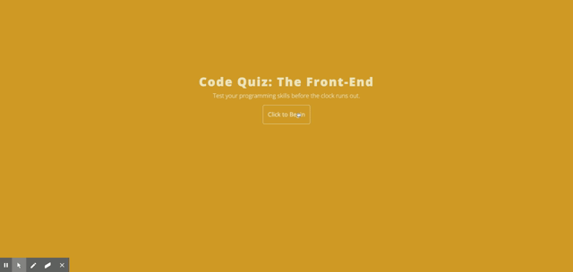

# Password Generator
[](https://opensource.org/licenses)

```
AS A coding bootcamp student
I WANT to take a timed quiz on JavaScript fundamentals that stores high scores
SO THAT I can gauge my progress compared to my peers
```

## Table of Contents

[Installation](#installation)

[Usage](#usage)

[Contribution](#contribution)

[Tests](#tests)

[Images](#images)

[Questions](#questions)

----

<a name="installation"></a>
### Installation

`git clone` repository

<a name="usage"></a>
### Usage

```
GIVEN I am taking a code quiz
WHEN I click the start button
THEN a timer starts and I am presented with a question
WHEN I answer a question
THEN I am presented with another question
WHEN I answer a question incorrectly
THEN time is subtracted from the clock
WHEN all questions are answered or the timer reaches 0
THEN the game is over
WHEN the game is over
THEN I can save my initials and score
```

<a name="contribution"></a>
### Contribution

Single contribution project 

<a name="tests"></a>
### Tests

Currently no testing

<a name="images"></a>
### Images
##### App Demo


----

<a name="questions"></a>
### Questions
##### Contact Me

Feel free to contact me via GitHub or email with any feedback - thanks for checking out my code!

[GitHub u/eaclumpkens](https://github.com/eaclumpkens)
eaclumpkens@gmail.com
